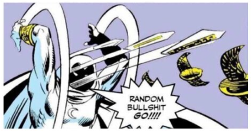

# Random Bullshit Go!!!!

## Metas de implementações

- [x] Transformador de caracteres em asterisco;
- [ ] Bin to dec;
- [ ] Random picks lolzin (?);
- [ ] Pick me a movie;
- [ ] Sim, uma pokedex;
- [ ] Input range para indicar a porcentagem da página;
- [ ] Uma tela que vai mostrando os estilos e onde é possível alterar os estilos;
- [ ] Resumo dos games do ano;
- [ ] Criar um link tree com degrade color;
- [ ] Adicionar um desfazer;
- [ ] Criar uma página com duas sidebars, a principal e seção da página;
- [ ] Gerador de senhas;
- [ ] Um portal como da nfs;